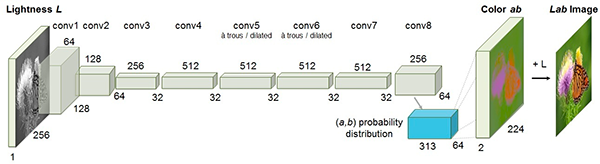
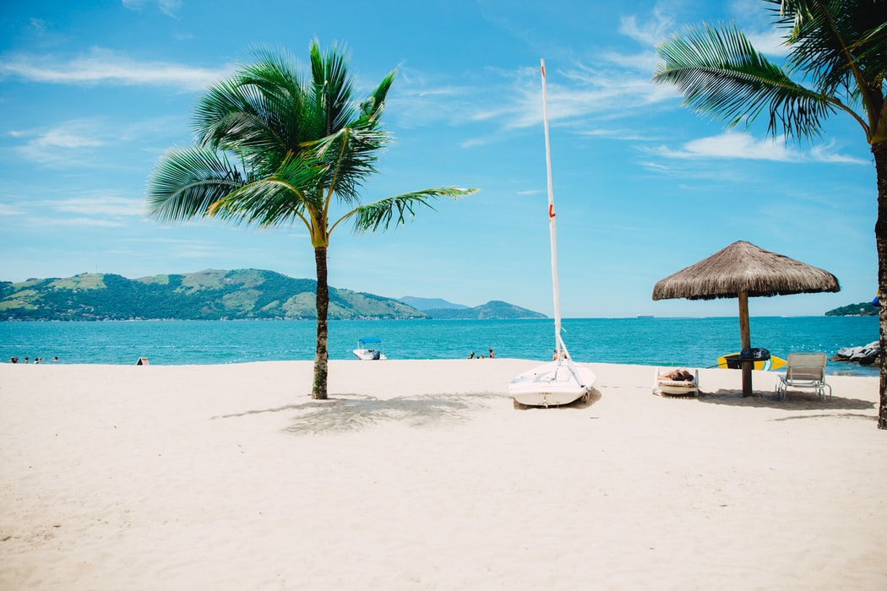
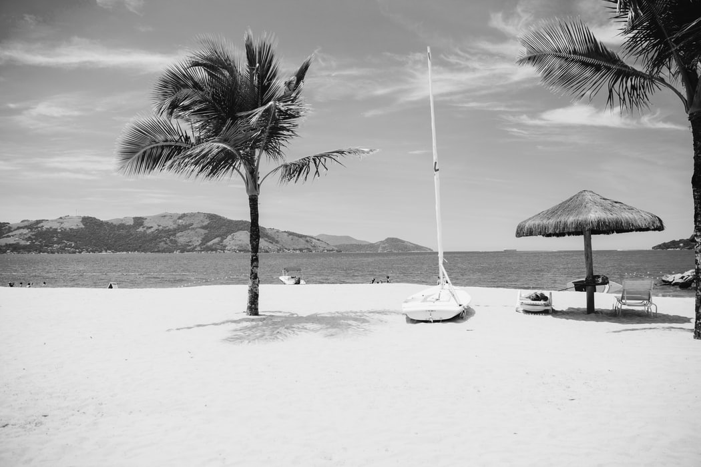
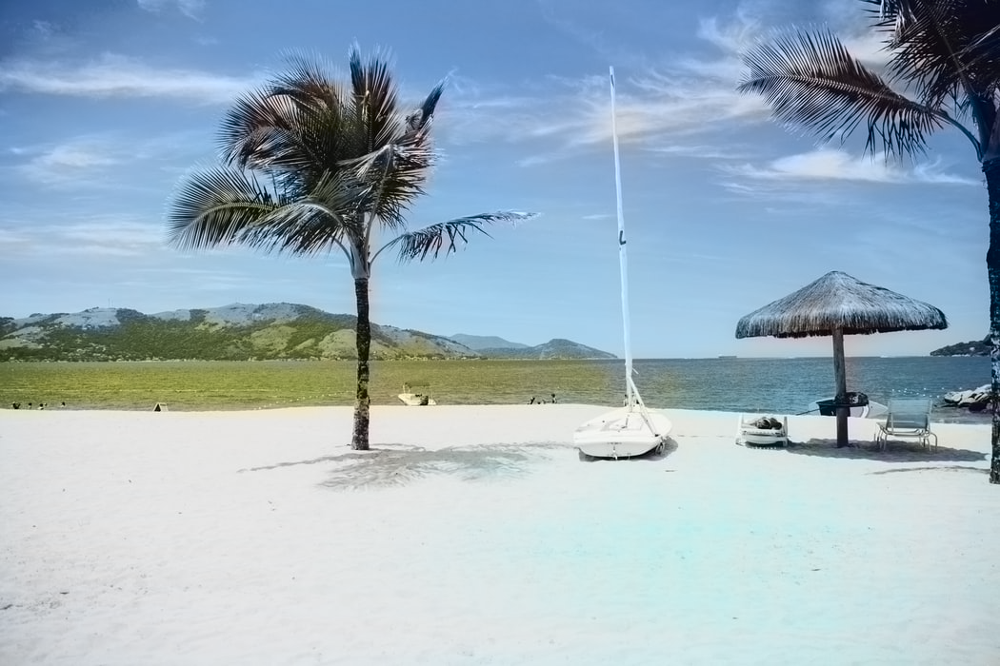
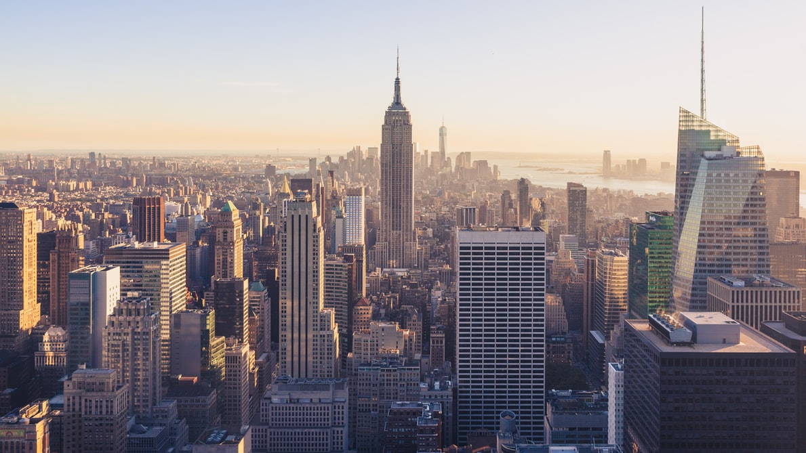
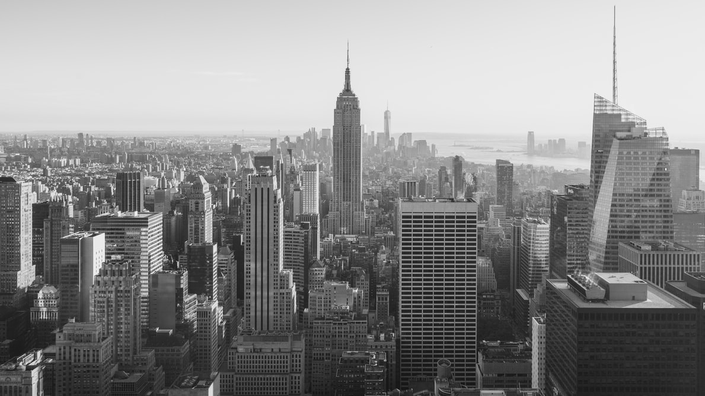
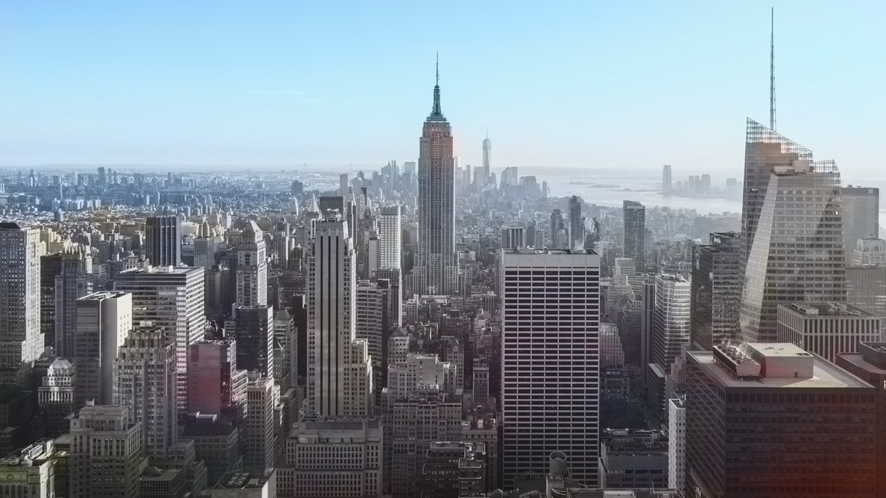

# Image_Colorization_OpenCV
Generating color images from black and white images using Deep Learning and OpenCV

## Overview
Image colorization is the process of taking an input grayscale (black and white) image and then producing an output colorized image.
In this project, I have used the Deep Learning algorithm from the paper ["Colorful Image Colorization"](https://arxiv.org/abs/1603.08511). This employs a CNN to analyze the colors across a set of color images, and their black and white versions. The network “hallucinates” what an input grayscale image would look like when colorized.The architecture of the deep learning model is as shown below:-



The images are converted to the LAB color space. The 'L' channel encodes the intensity values and hence can be used as the grayscale input to the network. The 'a' and 'b' color channels are predicted by the network. We can then combine the tree to get our predicted color image after converting it back to the RGB colorspace. This is a simplified explanation and for a detailed review of the techniques used to achieve the results, please go through the paper given in the reference.

## Arguments
```
--option           ---->     Choices=[image, video, camera] -- To perform inference on image or camera or video  
--file             ---->     Path to the image/video file  
--download_model   ---->     To download the pre-trained model (If you have not downloaded it manually) 
--prototxt         ---->     Path to Caffe prototxt file  
--model            ---->     Path to Caffe pre-trained model  
--points           ---->     Path to cluster center points  
```
Note:- The code looks for the model, prototxt and points file in the current directory by default, if not specified.

## Usage
* Inference on Image:-  
`python color.py --option image --file <path to image file>`
* Inference on Video:-  
`python color.py --option video --file <path to video file>`
* Inference on Web-Cam:-  
`python color.py --option camera`

## Sample Results
```-----------Original Image -------------------------- Gray Image -------------------------------Colorized Image----------```  
    
    

## References
* http://richzhang.github.io/colorization/  
* [Colorful Image Colorization by Richard Zhang, Phillip Isola, Alexei A. Efros](https://arxiv.org/abs/1603.08511)

Do let me know if you face any issues. I'll do my best to help you :)
Happy Learning People ! Keep chasing your dreams ! ⭐️
